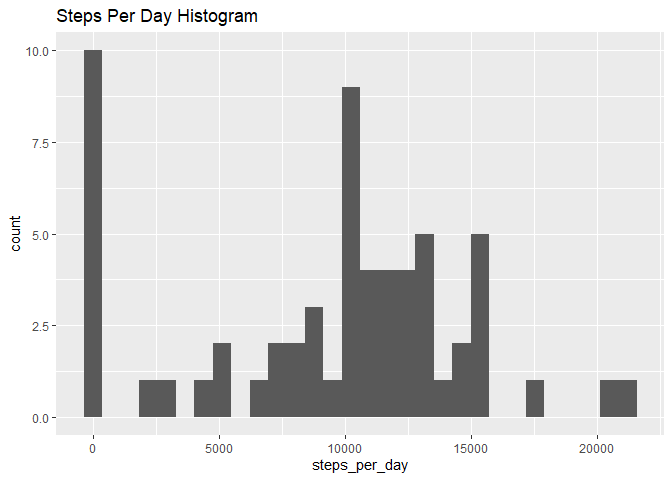
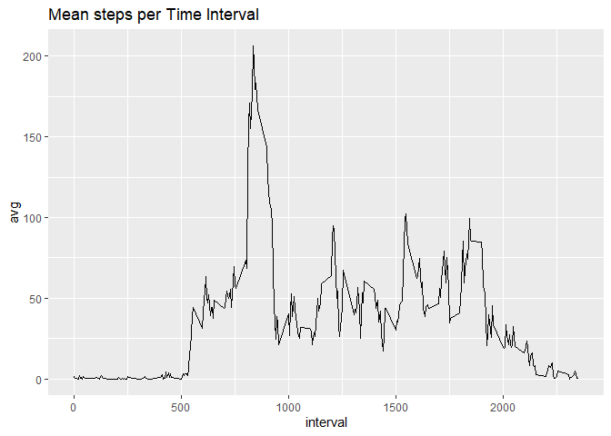
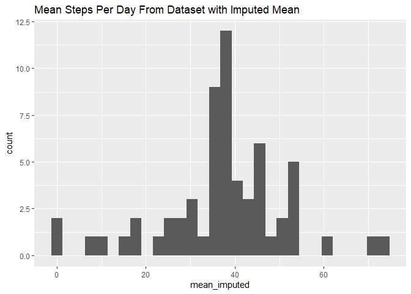
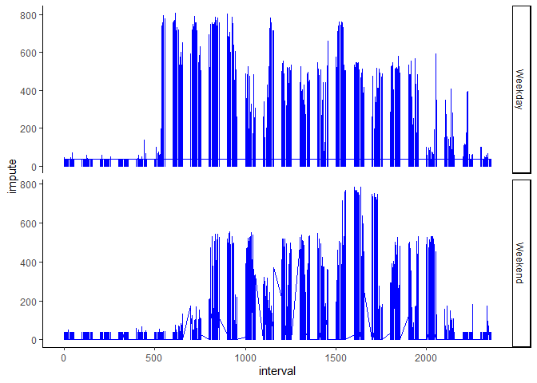

```r
fileUrl <- "https://d396qusza40orc.cloudfront.net/repdata%2Fdata%2Factivity.zip"
download.file(fileUrl, destfile = paste0(getwd(), '/repdata%2Fdata%2Factivity.zip'))
unzip("repdata%2Fdata%2Factivity.zip",exdir = "data")

act <- read.csv("data/activity.csv")
```

## Activity Data

Read in the data above to act dataframe. Then below we:

-Calculate the average steps per day

-Chart a histogram of steps per day

-Calculate the mean and median steps

-Chart the mean steps per time interval

-Identify that 835 is the five minute time interval with the highest average


```r
steps_per_day <- act %>% group_by(date) %>% dplyr::summarise(steps_per_day = sum(steps, na.rm = TRUE))

steps_per_day
```

```
## # A tibble: 61 x 2
##    date       steps_per_day
##    <fct>              <int>
##  1 2012-10-01             0
##  2 2012-10-02           126
##  3 2012-10-03         11352
##  4 2012-10-04         12116
##  5 2012-10-05         13294
##  6 2012-10-06         15420
##  7 2012-10-07         11015
##  8 2012-10-08             0
##  9 2012-10-09         12811
## 10 2012-10-10          9900
## # ... with 51 more rows
```

```r
ggplot(steps_per_day, aes(steps_per_day)) + geom_histogram() + ggtitle("Steps Per Day Histogram")
```

```
## `stat_bin()` using `bins = 30`. Pick better value with `binwidth`.
```

<!-- -->

```r
act %>% filter(!is.na(steps)) %>% dplyr::group_by(date) %>% dplyr::summarise(mean_steps = mean(steps, na.rm = TRUE), median_steps = median(steps, na.rm =TRUE))
```

```
## # A tibble: 53 x 3
##    date       mean_steps median_steps
##    <fct>           <dbl>        <dbl>
##  1 2012-10-02      0.438            0
##  2 2012-10-03     39.4              0
##  3 2012-10-04     42.1              0
##  4 2012-10-05     46.2              0
##  5 2012-10-06     53.5              0
##  6 2012-10-07     38.2              0
##  7 2012-10-09     44.5              0
##  8 2012-10-10     34.4              0
##  9 2012-10-11     35.8              0
## 10 2012-10-12     60.4              0
## # ... with 43 more rows
```

```r
act %>% filter(!is.na(steps)) %>% dplyr::group_by(interval) %>% dplyr::summarise(avg = mean(steps, na.rm = TRUE)) %>% ggplot(.,aes(interval, avg)) + geom_line() + ggtitle("Mean steps per Time Interval")
```

<!-- -->

## Impute NAs

Get rid of those dang NAs! First show the total number of NAs. Then create a new variable so that the mean replaces any NAs. Add a histogram of the imputed mean, and then show a table of the 


```r
sum(is.na(act$steps))
```

```
## [1] 2304
```

```r
act_imputed <- act %>% mutate(impute = ifelse(is.na(steps), mean(steps, na.rm = TRUE), steps))

act_imputed %>% dplyr::group_by(date) %>% dplyr::summarise(mean_imputed = mean(impute)) %>% ggplot(.,aes(mean_imputed)) + geom_histogram() + ggtitle("Mean Steps Per Day From Dataset with Imputed Mean")
```

```
## `stat_bin()` using `bins = 30`. Pick better value with `binwidth`.
```

<!-- -->

```r
act_imputed %>% dplyr::group_by(date) %>% dplyr::summarise(avg = mean(impute, na.rm = TRUE), median = median(impute, na.rm = TRUE)) %>% kable()
```


date                 avg    median
-----------  -----------  --------
2012-10-01    37.3825996   37.3826
2012-10-02     0.4375000    0.0000
2012-10-03    39.4166667    0.0000
2012-10-04    42.0694444    0.0000
2012-10-05    46.1597222    0.0000
2012-10-06    53.5416667    0.0000
2012-10-07    38.2465278    0.0000
2012-10-08    37.3825996   37.3826
2012-10-09    44.4826389    0.0000
2012-10-10    34.3750000    0.0000
2012-10-11    35.7777778    0.0000
2012-10-12    60.3541667    0.0000
2012-10-13    43.1458333    0.0000
2012-10-14    52.4236111    0.0000
2012-10-15    35.2048611    0.0000
2012-10-16    52.3750000    0.0000
2012-10-17    46.7083333    0.0000
2012-10-18    34.9166667    0.0000
2012-10-19    41.0729167    0.0000
2012-10-20    36.0937500    0.0000
2012-10-21    30.6284722    0.0000
2012-10-22    46.7361111    0.0000
2012-10-23    30.9652778    0.0000
2012-10-24    29.0104167    0.0000
2012-10-25     8.6527778    0.0000
2012-10-26    23.5347222    0.0000
2012-10-27    35.1354167    0.0000
2012-10-28    39.7847222    0.0000
2012-10-29    17.4236111    0.0000
2012-10-30    34.0937500    0.0000
2012-10-31    53.5208333    0.0000
2012-11-01    37.3825996   37.3826
2012-11-02    36.8055556    0.0000
2012-11-03    36.7048611    0.0000
2012-11-04    37.3825996   37.3826
2012-11-05    36.2465278    0.0000
2012-11-06    28.9375000    0.0000
2012-11-07    44.7326389    0.0000
2012-11-08    11.1770833    0.0000
2012-11-09    37.3825996   37.3826
2012-11-10    37.3825996   37.3826
2012-11-11    43.7777778    0.0000
2012-11-12    37.3784722    0.0000
2012-11-13    25.4722222    0.0000
2012-11-14    37.3825996   37.3826
2012-11-15     0.1423611    0.0000
2012-11-16    18.8923611    0.0000
2012-11-17    49.7881944    0.0000
2012-11-18    52.4652778    0.0000
2012-11-19    30.6979167    0.0000
2012-11-20    15.5277778    0.0000
2012-11-21    44.3993056    0.0000
2012-11-22    70.9270833    0.0000
2012-11-23    73.5902778    0.0000
2012-11-24    50.2708333    0.0000
2012-11-25    41.0902778    0.0000
2012-11-26    38.7569444    0.0000
2012-11-27    47.3819444    0.0000
2012-11-28    35.3576389    0.0000
2012-11-29    24.4687500    0.0000
2012-11-30    37.3825996   37.3826


## Weekday Analysis

Created a factor variable called weekday to show if it's a weekday or the weekend. Graphed the imputed mean per time interval for Weekdays vs. Weekends.


```r
act_weekday <- act_imputed %>% dplyr::mutate(day = weekdays(ymd(date)))

act_weekday <- act_weekday %>% mutate(weekday = ifelse(day %in% c("Saturday", "Sunday"), "Weekend", "Weekday"))

act_weekday$weekday <- factor(act_weekday$weekday, levels = c("Weekday", "Weekend"))

ggplot(act_weekday, aes(interval, impute)) + geom_line(color = "blue") + facet_grid(weekday~., scales = "free") + theme_classic()
```

<!-- -->

